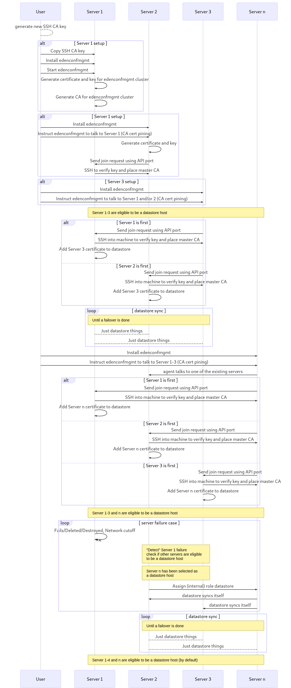
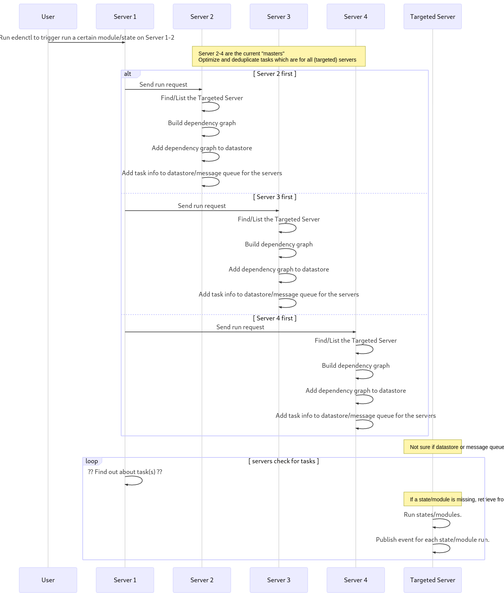

# v0

**Table of contents**

<!-- @import "[TOC]" {cmd="toc" depthFrom=2 depthTo=6 orderedList=false} -->
<!-- code_chunk_output -->

* [Software to solve problems aka "Evaluate all them software"](#software-to-solve-problems-aka-evaluate-all-them-software)
* [Environment Assumptions](#environment-assumptions)
* [Goals](#goals)
* [Flows](#flows)
	* [Initial start and Failover](#initial-start-and-failover)
	* [Run](#run)
* [Templating](#templating)
	* [Variables](#variables)
* [File Structure](#file-structure)
	* [Metadata](#metadata)
		* [Example Object](#example-object)
	* [Config File](#config-file)
	* [Variables](#variables-1)
		* ["Base" File](#base-file)
		* [Variables File](#variables-file)
		* ["From Host" Static Variable File](#from-host-static-variable-file)
	* [Template Macros](#template-macros)
		* ["Base" Template Macros File](#base-template-macros-file)
		* [Template Macros File](#template-macros-file)
	* [Jobs](#jobs)
	* [Tasks](#tasks)
		* [Example: Dependencies](#example-dependencies)
		* [Example: Orchestrated sharing of data betweem nodes](#example-orchestrated-sharing-of-data-betweem-nodes)
	* [Events](#events)
		* ["Base" Custom Events File](#base-custom-events-file)
		* [Custom Events Triggers](#custom-events-triggers)
	* [Event Reactor](#event-reactor)
		* [Example: Run Runbook on Prometheus Alert](#example-run-runbook-on-prometheus-alert)
		* [Example: Reacting to a failure of a certain step](#example-reacting-to-a-failure-of-a-certain-step)

<!-- /code_chunk_output -->

## Software to solve problems aka "Evaluate all them software"

Aka list of software and/or decisions to be evaluated/made.

- [x] Detect software/node failures
    - [x] Custom implementation. Nodes will "occasionally" talk to each other.
- [x] Key Value store
    - [x] [GitHub coreos/etcd](https://github.com/coreos/etcd)
- [x] Event distribution
    - [x] [GitHub grpc/grpc-go](https://github.com/grpc/grpc-go)
- [x] Modules
    - [x] File handling
		- [x] Golang native lib
    - [x] Package handling
        - [x] PackageKit
    - [x] Command Executor
        - [x] Golang native lib

## Environment Assumptions

These are the assumptions of the general environment where one would use this project/tool.

* (Always) at least 3 or more servers.
* All user given "state" code is in one or more git repositories.
* Network is "unsecure"/public/untrusted.
    * Connections to servers using SSH are considered secure.

## Goals

* If a node fails which is currently a datastore, the cluster can continue to work.
    * An existing node that is eligible to be a datastore will take over the datastore role.
* Running a "state" allows another "state" to use it and/or it's output as a variable.
* `require` and `require_in` and so on from Saltstack are correctly identified and applied to the ordering.
    * NOTE: There will be different ordering modes, e.g.:
        - "justdoit" mode which does not do any ordering (except `require`, etc are respected) and just fires all others at once.
        - "ansible" mode which does execute one task after another, respecting `require`, etc.
        - `genius` mode which does "complex" ordering and optimization (e.g., add a repo first and then run `dnf update`).
            - **Will probably not be a thing in the _zero_ (first) version**
* There are some simple default modules.
    * Planned:
        * `cmd`
    * Future:
        * `pkg` (PackageKit ?)
        * `pkgrepo` (PackageKit ?)
* Extension modules can be copied from the datastore or an "external" source, and be verified.

## Flows
### Initial start and Failover



See [v0-bak/flow-init_and_failover.mmd](v0-bak/flow-init_and_failover.mmd) for source code of diagram.

### Run



See [v0-bak/flow-run.mmd](v0-bak/flow-run.mmd) for source code of diagram.

## Templating

### Variables

| Name         | Description                                                                              | Example Usage                                                                                                                                          |
| ------------ | ---------------------------------------------------------------------------------------- | ------------------------------------------------------------------------------------------------------------------------------------------------------ |
| `eden`       | Object containing all edenconfmgmt functions and/or variables.                           | 1. To get the edenconfmgmt version running, 2. getting a list of servers by label.                                                                     |
| `event`      | Event info and data (only available when Job has been triggered through event reaction). | To retrieve the occurences how often the event was already called.                                                                                     |
| `servervars` | Facts about all targeted servers.                                                        | Variables/Facts of all servers, useful to build a list of servers for, e.g., HAProxy.                                                                  |
| `macros`     | The user defined macros (template functions/shortcuts).                                  | To call a user defined "macro".                                                                                                                        |
| `vars`       | Variables defined by user.                                                               | Variables that have been defined by the user through a matching [Variables - Base File](#base-file) and [Variables - Variables File](#variables-file). |
| `server`     | Node object of the current server.                                                       | Retrieve labels of the current server.                                                                                                                 |

## File Structure

### Metadata

```yaml
apiVersion: v1alpha
kind: Config
name: object-name
labels:
  my-label-1: my-label-1-value
annotations:
  my-annotation-1: my-annotation-1-value
# The UUID is set by the "master".
uuid: 5acfcdce-be46-4f34-81be-9fd6980c2224
```

#### Example Object

```yaml
metadata:
  apiVersion: v1alpha
  kind: Config
  name: object-name
  labels:
    my-label-1: my-label-1-value
  annotations:
    my-annotation-1: my-annotation-1-value
  # The UUID is generated/set by the "master".
  uuid: 5acfcdce-be46-4f34-81be-9fd6980c2224
spec:
  type: ""
  variables:
    my-variable-1:
      example1: true
    my-variable-2: 10.0
```

### Config File

Config file the cluster.

```yaml
config:
  dataStore:
    type: etcd
    count: 3
```

### Variables

System and user defined variables will be available under the variable `variables`.
This is to prevent that variables overwritten each other and/or existing variables.

#### "Base" File

A bit [hiera](https://github.com/puppetlabs/hiera) like file name matching with a pinch of Salstack's "base"/"top" files.

```yaml
files:
  '*':
    - name: common
    - name: network
      paths:
        - network/{{ server.fqdn }}.yaml
        - network/{{ server.os }}.yaml
```

#### Variables File

```yaml
sysctl:
  fs.file-max: 2097152
  net.ipv4.ip_local_port_range: "8192 65535"

my_variable: true
```

#### "From Host" Static Variable File

**NOTE** These files are read by the agent on each node during start.

**NOTE** A "live" reload could also be implemented either by inotify watching on file(s) or a function being able to be trigger a reload.

```yaml
network:
  defaultInterface: eth1
```

### Template Macros

#### "Base" Template Macros File

```yaml
macros:
  '*':
    - name: uptime
  'role=kubernetes-*':
    - name: kubeadm/kubernetes
```

#### Template Macros File

```yaml
uptime:
  # `file.contents` would be better here
  action: cmd.run
  parameters:
    - cmd: cat /proc/uptime

kubernetes_cluster_master_count:
  template.expression:
    - content: |
      {{ macros['servers_get_by_label']('kubernetes.io/kubeadm-master=') | length }}
```

### Jobs

```yaml
jobs:
  '*':
    - name: timezone
  'role=kubernetes-master':
    - name: kubeadm
    - name: kubeadm/kubernetes-master
  'role=kubernetes-worker':
    - name: kubeadm/kubernetes-worker
      conditions:
        when:
          condition: macros['kubernetes_cluster_master_count'] > 0
          retry:
            interval: 30s
            limit: 0
```

### Tasks

#### Example: Dependencies

```yaml
---
# can also be specified for steps in file "globally"
runOptions:
steps:
- name: install vnstat package
  spec:
    action: pkg.installed
    parameters:
      - name: vnstat
      - refresh: true

# this step will automatically fail if the service (re-)start up failed
- name: start vnstat
  action: service.ensure
  parameters:
    - state: started
    - name: vnstat
    - require:
      - pkg: vnstat
  runOptions:
    # cause all nodes to finish this step before continuing
    # be aware that "only" this and dependent tasks are "halted"
    sync: true

- name: wait some time
  action: time.sleep_rand
  parameters:
    - time: 15s
    - require:
      - service: vnstat

- name: check if vnstat is producing metrics # well just as an example
  action: cmd.run
  parameters:
    - cmd: vnstat
    - timeout: 5s
  conditions:
    # if this condition is not fullfilled it will automatically fail
    success:
      condition: steps['start vnstat'].State == 'running'
    # this can be used to "block" continuation when `serialize`
    # is used (e.g., load balancer, cluster health)
    continue:
      # `macros['cluster_healthy']()` will call the `cluster_healthy` function
      condition: macros['cluster_healthy']() == true
      retry:
        interval: 15s
        limit: 20
  runOptions:
    # only run on two nodes at the same time
    serialize:
      count: 2
      failAfterAllTargetsRan: true
```

#### Example: Orchestrated sharing of data betweem nodes

**NOTE** Where `data` is meant to be "small", e.g., tokens, certificates.
**NOTE** Also the above example already used "orchestration" tools like `serialize` and/or `sync`, but wait there is more.

```yaml
---
steps:
- name: install kubeadm and kubelet package
  action: pkg.installed
  parameters:
    - pkgs:
        - kubelet
        - kubeadm
    - refresh: true

# Such an orchestrated call can also be made in templates
- name: generate kubeadm token
  action: cmd.run
  parameters:
    - cmd: kubeadm token create --tl=10m --description='{{ Server.Spec.FQDN }}'
  runOptions:
    target:
      limit: 1
      hosts:
        - 'role=kubernetes-master'

# Other things also possible would be to do something like this:
# The step below would "publish" the /etc/kubernetes/pki/ directory for each node that
# is targteted during this run when the condition(s) are met.
- name: get kubernetes master certs
  action: file.content
  parameters:
    - name: /etc/kubernetes/pki/
    - recursive: true
  runOptions:
    target:
      limit: 1
      hosts:
        - 'role=kubernetes-master'
  conditions:
    when:
      condition: 'kubernetes-master' in Server.ObjectMetadata.Labels

# Retrieve the "published" files and put them on the current server.
- name: place kubernetes master certs
  action: file.managed
  parameters:
    - name: /etc/kubernetes/pki/
    - from:
      - file: 'get kubernetes master certs'
  conditions:
    when:
      condition: 'kubernetes-master' in Server.ObjectMetadata.Labels

- name: join node using token
  action: cmd.run
  parameters:
    - cmd: kubeadm --token={{ steps['generate kubeadm token'].StdOut }}
```

### Events

#### "Base" Custom Events File

Controls which events are evaluated and "executed" for each server(s).

**Filename**: `config.yaml`

```yaml
events:
  triggers:
    # label (and variable?) matching to servers
    '*':
      - name: node_updates_available
```

#### Custom Events Triggers

A thing to note, one can probably, even with just this "yaml and go template" magic, do some interesting events, but the main focus will be to have "low" level triggers (e.g., as the example below are my servers uptodate). Other events such as a Prometheus alerting should be

**Filename**: `node_updates_available.yaml`

```yaml
# This example should normally be done by a monitoring tool, such as Prometheus.
node_updates_available:
  # when a node is not uptodate package-wise trigger event
  expression: macros['pkg.uptodate']() != true
  name: node_updates_available
```

### Event Reactor

#### Example: Run Runbook on Prometheus Alert

```yaml
reactions:
  # This would respond to alerts named `prometheus/alert/my-cool-alert`
  prometheus/alert/my-cool-alert:
    reaction:
      jobs:
        '*':
          - name: prometheus/alert-runbooks/my-cool-alert
    triggerLimiter:
      minOccurences: 2
      reReactDealy: 5m
      waitForMore:
        timeout: 2m
        resetTimeoutOnMore: true
```

Where the `prometheus/alert-runbooks/my-cool-alert` is a normal [Job](#jobs) file that will be run.
**But** a "special" variable named `event` will be given in the context of the steps executed from this [Job](#jobs).

```yaml
type Event struct {
    Name string
    Occurences int
    Data map[string]interface{}
}
```

#### Example: Reacting to a failure of a certain step

**Events Reaction File**:

```yaml
reactions:
  edenconfmgmt/failure/step:
    reaction:
      conditions:
        when:
          condition: event.occurences > 10
      jobs:
        - name: orchestrated/reboot_server
```

**Jobs File** (`orchestrated/reboot_server.yaml`):

```yaml
jobs:
  '*':
    - name: reboot_server
      conditions:
        when:
          condition: macros['kubernetes_cluster_healthy']() == true
          retry:
            interval: 15s
            limit: 20
```

**Steps File**:

```yaml
steps:
- name: kubernetes drain node
  action: cmd.run
  parameters:
    - cmd: kubectl drain --ignore-data... {{ server.name }}

- name: reboot server
  action: cmd.run
  parameters:
    - cmd: reboot
  runOptions:
    failAfterAllTargetsRan: true
```
