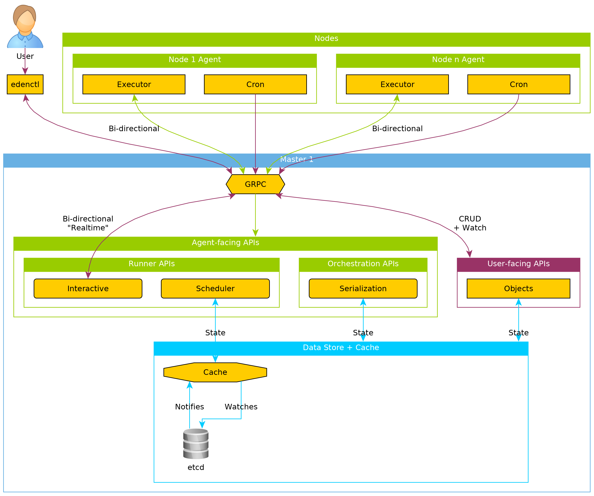
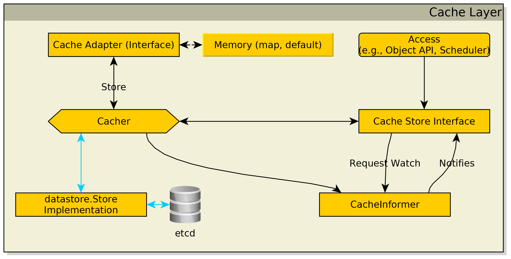
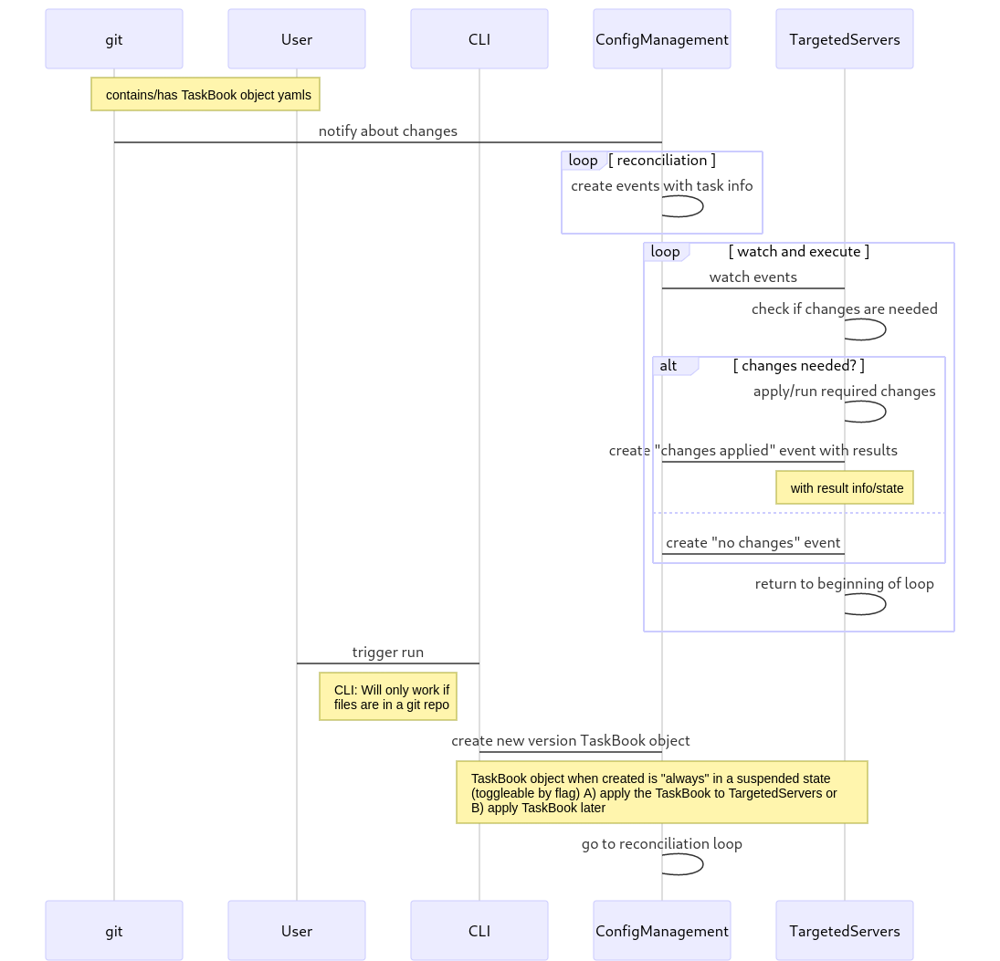
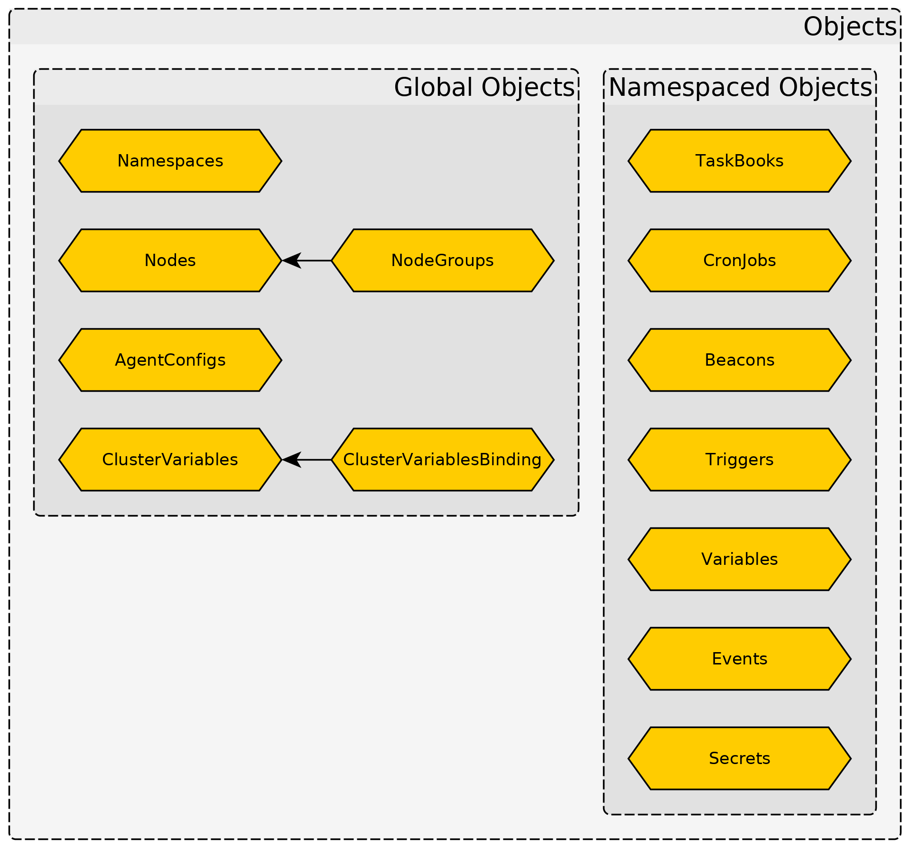
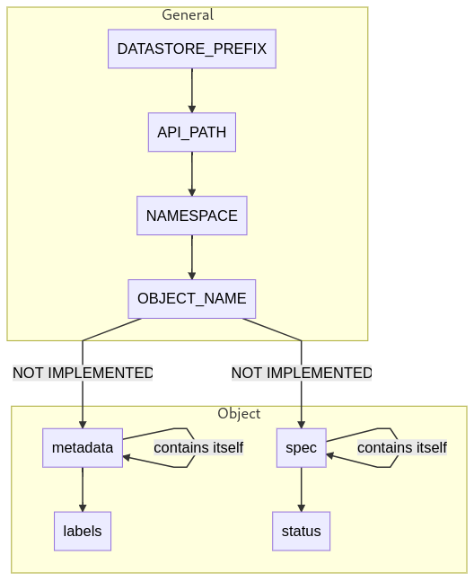

# v0

**Table of contents**

<!-- TOC depthFrom:2 depthTo:6 withLinks:1 updateOnSave:1 orderedList:0 -->

- [Architecture](#architecture)
	- [Cache Layer](#cache-layer)
- [Flow](#flow)
- [Software / Libraries](#software-libraries)
- [Environment Assumptions](#environment-assumptions)
- [API](#api)
- [What do we need?](#what-do-we-need)
- [Objects](#objects)
	- [Global Objects](#global-objects)
	- [Namespaced Objects](#namespaced-objects)
- [Objects Structure](#objects-structure)
	- [Object Metadata](#object-metadata)
	- [Global and Namespaced Objects](#global-and-namespaced-objects)
- [Datastore](#datastore)
	- [Object Data Layout](#object-data-layout)
	- [Watch/Cache Concept](#watchcache-concept)

<!-- /TOC -->

## Architecture



### Cache Layer



## Flow



## Software / Libraries

- Detect software/node failures
    - Custom implementation. Nodes will "occasionally" talk to each other.
- Key Value store
    - [GitHub coreos/etcd](https://github.com/coreos/etcd)
- Modules
    - File handling
		- Golang native lib(s) - [io pkg](https://golang.org/pkg/io/), [os pkg](https://golang.org/pkg/os/)
    - Package handling
        - [PackageKit](https://www.freedesktop.org/software/PackageKit/)
    - Command Executor
		- Golang native lib(s) - [os/exec pkg](https://golang.org/pkg/os/exec/)

## Environment Assumptions

These are the assumptions of the general environment where one would use this project/tool.

* One or at least 3 servers.
* All user given "state" code is in one or more git repositories.
* Network is "unsecure"/public/untrusted.
    * Connections to servers using SSH are considered secure.

## API

GRPC. So far I'm happy with GRPC.

Even though there are some limitations in point of `repeated` keyword which if not present would help make the layout of tasks/steps/actions in a YAML "look and feel" better.

## What do we need?

* Facts from nodes.
* Templating for files (e.g., Config file templating).
* Syncronizing tasks (e.g., serialization (X nodes at a time), all nodes need to complete task before continuing).
* Actions/Tasks (modules) to be able to run (e.g., a command can be run).
* Syncing a variable / file (e.g., token, certificate) between one or more nodes (1 to many).

## Objects



### Global Objects

* `Namespaces`
	* Separator for projects, teams or organizations.
	* Like `Namespaces` in Kubernetes, a name separation.
* `Nodes`
	* Servers the management daemon is running on.
* `NodeGroups`
    * "A list of nodes".
    * Label selectors for Nodes.
    * Or just a plain list of Nodes (not recommended).
* `AgentConfigs`
    * Configuration for e.g., management daemon, data store and defaults for action/task runs.
* `ClusterVariables`
    * Global Variables are either defined for a single server a NodeGroup(s).
    * _Types_:
        * Static
        * Dynamically "calculated", meaning Actions/Tasks can be run and also other variables can be "combined".
* `ClusterVariablesBinding`
	* Bind `ClusterVariables` to `Namespaces` and `NodeGroups`.

### Namespaced Objects

* `TaskBooks`
    * Contains actions/tasks in a grouped/collection manner.
	* But can also "just" contain one or more "links" to git repositories containing actions/tasks.
		* Mixed between first and this list point should be possible.
* `Variables`
    * Variables are either defined for a single server a `NodeGroups`.
	* Global Variables are either defined for a single server a NodeGroup(s).
    * _Types_:
        * Static
        * Dynamically "calculated", meaning Actions/Tasks can be run and also other variables can be "combined".
* `CronJobs`
    * Action(s)/Task(s) to be run by a defined schedule.
    * Can also point to one or more `TaskBooks`.
* `Beacons`
    * "Checks" which can be periodically run and then in return trigger an `Events`.
* `Triggers`
    * Trigger definitions with time and count conditions.
* `Events`
    * Events which are affecting the namespace they are in.
	* Cluster wide events are thrown in the "system" `Namespace`.
    * _Examples_:
        * Action/Task has been run.
        * `TaskBook` run has completed.
        * "Check/Monitor" events: Like Salt `Beacons`.
* `Secrets`
	* Dynamically loaded variables, tokens, etc. from systems such as, e.g., Hashicorp Vault.
	* Or directly specified.

## Objects Structure

### Object Metadata

```yaml
metadata:
  apiVersion: v1alpha
  kind: Config
  name: object-name
  # If the object is namespaced a namespace must be set.
  namespace: example123
  labels:
    label-1: label-1-value
  annotations:
    annotation-1: annotation-1-value
  # The UUID is set by the "master" in which the object has been "accepted".
  uuid: 5acfcdce-be46-4f34-81be-9fd6980c2224
[...]
```

### Global and Namespaced Objects

See the `pkg/apis/*/*.proto` files (path is relative to repository root).

## Datastore

ETCD because Kubernetes uses it too.. wait what.

### Object Data Layout

For global and namespaced Objects the path in itself is the same except that the `NAMESPACE` is not their for global Objects.



### Watch/Cache Concept

Each API's cache thingy in `OBJECTNAMEService` should do a ~~barrel roll~~ watch on it's objects in the store.
At the point of writing this it feels "okay" to do one general watch per API version (and/or per object namespace).

If the datastore is not the bottleneck, sharding could be done on a per API version and/or per object namespace.
