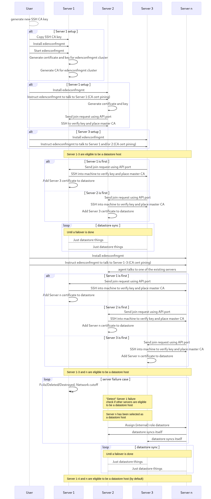
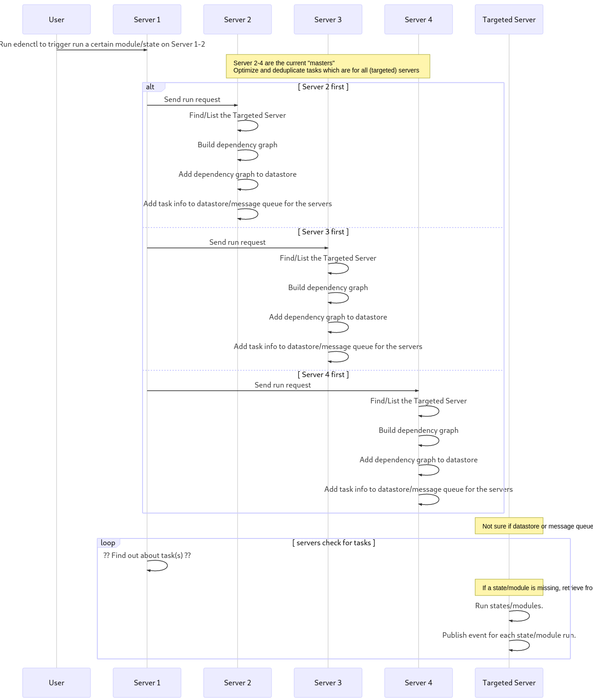

# v0

**Table of contents**


<!-- @import "[TOC]" {cmd="toc" depthFrom=2 depthTo=6 orderedList=false} -->
<!-- code_chunk_output -->

* [Software to solve problems aka "Evaluate all them software"](#software-to-solve-problems-aka-evaluate-all-them-software)
* [Environment Assumptions](#environment-assumptions)
* [Goals](#goals)
* [Flows](#flows)
	* [Initial start and Failover](#initial-start-and-failover)
	* [Run](#run)
* [Templating](#templating)
	* [Variables](#variables)
* [File Structure](#file-structure)
	* [Variables](#variables-1)
		* ["Base" File](#base-file)
		* [Variable File](#variable-file)
		* ["From Host" Variable File](#from-host-variable-file)
	* [Custom Macros](#custom-macros)
		* ["Base" Custom Macros File](#base-custom-macros-file)
		* [Custom Macros File](#custom-macros-file)
	* [Jobs](#jobs)
	* [Tasks](#tasks)
		* [Example: Dependencies](#example-dependencies)
		* [Example: Orchestrated sharing of data betweem nodes](#example-orchestrated-sharing-of-data-betweem-nodes)
	* [Events](#events)
		* ["Base" Custom Events File](#base-custom-events-file)
		* [Custom Events Triggers](#custom-events-triggers)
	* [Events Reaction](#events-reaction)
		* [Example: Run Runbook on Prometheus Alert](#example-run-runbook-on-prometheus-alert)
		* [Example: Reacting to a failure of a certain step](#example-reacting-to-a-failure-of-a-certain-step)

<!-- /code_chunk_output -->

## Software to solve problems aka "Evaluate all them software"

Aka list of software and/or decisions to be evaluated/made.

- [x] Detect software/node failures
    - [x] Custom implementation. Nodes will "occasionally" talk to each other.
- [x] Key Value store
    - [x] [GitHub coreos/etcd](https://github.com/coreos/etcd)
- [x] Event distribution
    - [x] [GitHub grpc/grpc-go](https://github.com/grpc/grpc-go)
- [x] Modules
    - [x] File handling
		- [x] Golang native lib
    - [x] Package handling
        - [x] PackageKit
    - [x] Command Executor
        - [x] Golang native lib

## Environment Assumptions

These are the assumptions of the general environment where one would use this project/tool.

* (Always) at least 3 or more servers.
* All user given "state" code is in one or more git repositories.
* Network is "unsecure"/public/untrusted.
    * Connections to servers using SSH are considered secure.

## Goals

* If a node fails which is currently a datastore, the cluster can continue to work.
    * An existing node that is eligible to be a datastore will take over the datastore role.
* Running a "state" allows another "state" to use it and/or it's output as a variable.
* `require` and `require_in` and so on from Saltstack are correctly identified and applied to the ordering.
    * NOTE: There will be different ordering modes, e.g.:
        - "justdoit" mode which does not do any ordering (except `require`, etc are respected) and just fires all others at once.
        - "ansible" mode which does execute one task after another, respecting `require`, etc.
        - `genius` mode which does "complex" ordering and optimization (e.g., add a repo first and then run `dnf update`).
            - **Will probably not be a thing in the _zero_ (first) version**
* There are some simple default modules.
    * Planned:
        * `cmd`
    * Future:
        * `pkg` (PackageKit ?)
        * `pkgrepo` (PackageKit ?)
* Extension modules can be copied from the datastore or an "external" source, and be verified.

## Flows
### Initial start and Failover



See [v0/flow-init_and_failover.mmd](v0/flow-init_and_failover.mmd) for source code of diagram.

### Run



See [v0/flow-run.mmd](v0/flow-run.mmd) for source code of diagram.

## Templating

### Variables

| Name        | Description                       |
| ----------- | --------------------------------- |
| `macros`    | Macros.                           |
| `variables` | Variables defined by user.        |
| `event`     | Event info and data.              |
| `server`    | Server info (the current server). |

## File Structure

### Variables

System and user defined variables will be available under the variable `variables`.
This is to prevent that variables overwritten each other and/or existing variables.

#### "Base" File

A bit [hiera](https://github.com/puppetlabs/hiera) like.

```yaml
files:
  '*':
    - name: common
    - name: network
      paths:
        - network/{{ server.fqdn }}.yaml
        - network/{{ server.os }}.yaml
```

#### Variable File

```yaml
sysctl:
  fs.file-max: 2097152
  net.ipv4.ip_local_port_range: "8192 65535"

my_variable: true
```

#### "From Host" Variable File

**NOTE** These files are read by the edenconfmgmt daemon during start.

```yaml
network:
  defaultInterface: eth1
```

### Custom Macros

#### "Base" Custom Macros File

```yaml
macros:
  '*':
    - name: uptime
  'role=kubernetes-*':
    - name: kubeadm/kubernetes
```

#### Custom Macros File

```yaml
uptime:
  # `file.contents` would be better here
  cmd.run:
    - cmd: cat /proc/uptime

kubernetes_cluster_master_count:
  template.expression:
    - content: |
      {{ macros['servers_get_by_label']('kubernetes.io/kubeadm-master=') | length }}
```

### Jobs

```yaml
jobs:
  '*':
    - name: timezone
  'role=kubernetes-master':
    - name: kubeadm
    - name: kubeadm/kubernetes-master
  'role=kubernetes-worker':
    - name: kubeadm/kubernetes-worker
      conditions:
        when:
          condition: macros['kubernetes_cluster_master_count'] > 0
          retry:
            interval: 30s
            limit: 0
```

### Tasks

#### Example: Dependencies

```yaml
---
# can also be specified for steps in file "globally"
runOptions:
steps:
- install vnstat package:
    pkg.installed:
      - name: vnstat
      - refresh: true

# this step will automatically fail if the service (re-)start up failed
- start vnstat:
    service.ensure:
      - state: started
      - name: vnstat
      - require:
        - pkg: vnstat
    runOptions:
      # cause all nodes to finish this step before continuing
      # be aware that "only" this and dependent tasks are "halted"
      sync: true

- wait some time:
    time.sleep_rand:
      - time: 15s
      - require:
        - service: vnstat

- check if vnstat is producing metrics: # well just as an example
    cmd.run:
      - cmd: vnstat
      - timeout: 5s
    conditions:
      # if this condition is not fullfilled it will automatically fail
      success:
        condition: steps['start vnstat'].State == 'running'
      # this can be used to "block" continuation when `serialize`
      # is used (e.g., load balancer, cluster health)
      continue:
        # `macros['cluster_healthy']()` will call the `cluster_healthy` function
        condition: macros['cluster_healthy']() == true
        retry:
          interval: 15s
          limit: 20
    runOptions:
      # only run on two nodes at the same time
      serialize:
        count: 2
        ignoreFailures: true
```

#### Example: Orchestrated sharing of data betweem nodes

**NOTE** Where `data` is meant to be "small", e.g., tokens, certificates.
**NOTE** Also the above example already used "orchestration" tools like `serialize` and/or `sync`, but wait there is more.

```yaml
---
steps:
- install kubeadm and kubelet package:
    pkg.installed:
      - pkgs:
          - kubelet
          - kubeadm
      - refresh: true

# Such an orchestrated call can also be made in templates
- generate kubeadm token:
    cmd.run:
      - cmd: kubeadm token create --tl=10m --description='{{ Server.Spec.FQDN }}'
    runOptions:
      target:
        limit: 1
        hosts: 'role=kubernetes-master'

# Other things also possible would be to do something like this:
# The step below would "publish" the /etc/kubernetes/pki/ directory for each node that
# is targteted during this run when the condition(s) are met.
- get kubernetes master certs:
    file.content:
      - name: /etc/kubernetes/pki/
      - recursive: true
    runOptions:
      target:
        limit: 1
        hosts: 'role=kubernetes-master'
    conditions:
      when:
        condition: 'kubernetes-master' in Server.ObjectMetadata.Labels

# Retrieve the "published" files and put them on the current server.
- place kubernetes master certs:
    file.managed:
      - name: /etc/kubernetes/pki/
      - from:
        - file: 'get kubernetes master certs'
    conditions:
      when:
        condition: 'kubernetes-master' in Server.ObjectMetadata.Labels

- join node using token:
    cmd.run:
      - cmd: kubeadm --token={{ steps['generate kubeadm token'].StdOut }}
```

### Events

#### "Base" Custom Events File

Controls which events are evaluated and "executed" for each server(s).

**Filename**: `config.yaml`

```yaml
events:
  triggers:
    # label (and variable?) matching to servers
    '*':
      - name: node_updates_available
```

#### Custom Events Triggers

A thing to note, one can probably, even with just this "yaml and go template" magic, do some interesting events, but the main focus will be to have "low" level triggers (e.g., as the example below are my servers uptodate). Other events such as a Prometheus alerting should be

**Filename**: `node_updates_available.yaml`

```yaml
# This example should normally be done by a monitoring tool, such as Prometheus.
node_updates_available:
  # when a node is not uptodate package-wise trigger event
  expression: macros['pkg.uptodate']() != true
  name: node_updates_available
```

### Events Reaction

#### Example: Run Runbook on Prometheus Alert

```yaml
reactions:
  # This would respond to alerts named `prometheus/alert/my-cool-alert`
  prometheus/alert/my-cool-alert:
    reaction:
      jobs:
        - name: prometheus/alert-runbooks/my-cool-alert
```

Where the `prometheus/alert-runbooks/my-cool-alert` is a normal [Job](#jobs) file that will be run.
**But** a "special" variable named `event` will be given in the context of the steps executed from this [Job](#jobs).

```yaml
type Event struct {
    Name string
    Occurences int
    Data map[string]interface{}
}
```

#### Example: Reacting to a failure of a certain step

**Events Reaction File**:

```yaml
reactions:
  edenconfmgmt/failure/step:
    reaction:
      conditions:
        when:
          condition: event.occurences > 10
      jobs:
        - name: orchestrated/reboot_server
```

**Jobs File** (`orchestrated/reboot_server.yaml`):

```yaml
jobs:
  '*':
    - name: reboot_server
      conditions:
        when:
          condition: macros['kubernetes_cluster_healthy']() == true
          retry:
            interval: 15s
            limit: 20
```

**Steps File**:

```yaml
steps:
- kubernetes drain node:
    cmd.run:
      - cmd: kubectl drain --ignore-data... {{ server.name }}

- reboot server:
    cmd.run:
      - cmd: reboot
    conditions:
      ignoreFailures: true
```
