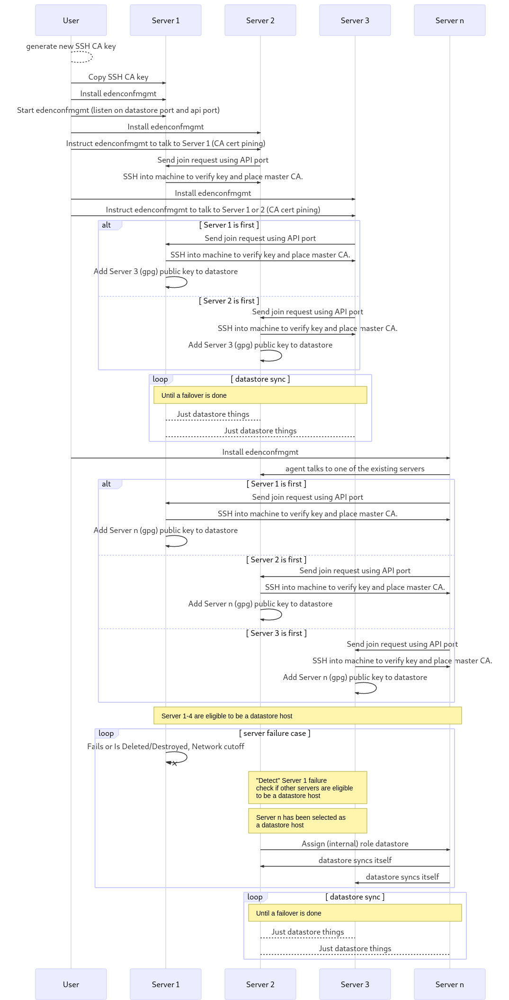

# v0

**Table of contents**

<!-- TOC depthFrom:2 depthTo:6 withLinks:1 updateOnSave:1 orderedList:0 -->

- [Table of contents](#table-of-contents)
- [Software used](#software-used)

<!-- /TOC -->

## Software to solve problems aka "Evaluate all them software"

Aka list of software and/or decisions to be evaluated/made.

- [ ] Detect software/node failures
    - [ ] Hasicorp Serf
    - [ ] Hasicorp Consul
- [ ] Key Value store
    - [ ] CoreOS ETCD
    - [ ] Hasicorp Serf
- [ ] Event
    - [ ] Can use Key Value store?
    - [ ] ZeroMQ

## TODO

### Environment Assumptions

These are the assumptions of the general environment where one would use this project/tool.

* At least 3 servers.
* All user given "state" code is in git repository.
* Network is "unsecure"/public/untrusted.
    * Connections using SSH are considered secure.

### Goals

* SSH CA used for server authentication to establish initial trust.
    * After that GPG is used for encrypt/decrypt.
* If a node fails which is currently a datastore, the cluster can continue to work.
* Extension modules can be copied from the datastore or an "external" source, and be verified.
* Running a "state" allows another "state" to use it and/or it's output as a variable.

### Action Flow

**TODO** This diagram needs to be updated to fit the [Assumptions](#assumptions).

See [v0-flow.mmd](v0-flow.mmd) for source code of diagram.
